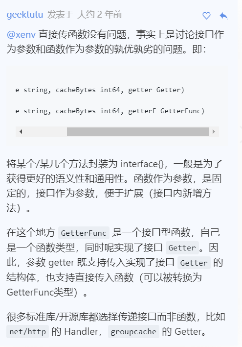

# Go-Cache 项目介绍
> GoCache是一个单机并发缓存，底层使用LRU淘汰策略，并且通过一致性哈希算法实现分布式缓存。类似于`Memcache`的key-value缓存。
## LRU缓存淘汰策略
常见的缓存淘汰算法有：FIFO、LFU和LRU。其中LRU算法的淘汰策略是，如果数据最近北方问过，那么将来被访问的概率也会更高。

LRU算法通过维护一个双向队列以及一个map来实现，每次访问和添加节点都插入队列末尾，而只提供一个删除队首元素的接口。

```go
type Cache struct {
	maxBytes    int64
	nbytes      int64
	ll          *list.List
	cache       map[string]*list.Element
	OnEvicted   func(key string, value Value)
}

type entry struct {
	key string
	value Value
}

type Value interface {
	Len() int
}
```
通常写LRU的时候我们都是指定最大的节点个数，但是由于每个节点的大小不一定都相同，所以这里采用节点所占大小来作为判断能否继续插入的条件。

这里的双向链表使用标准库`list.List`，其节点`list.Element`包括`prev和next指针`以及值`value any`，`any`是`interface{}`。

所以我们双向链表真实的数据结构定义为`entry`，并将其作为`list.Element`的value。

**LRU Cache的三个方法**：
1. 查找：
```go
func (c *Cache) Get(key string) (value Value, ok bool) {}
```
2. 删除：
```go
func (c *Cache) RemoveOldest(key string) {}
```
3. 新增/修改：
```go
func (c *Cache) Add(key string, value Value) {}
```
注意：新增的时候记得更新容量。这里有个问题，按照最大个数方法保存时，如果已经到达最大个数时，则直接删掉队尾节点。但是如果时按照使用空间，则应该先判断能否保存，如果不能则删掉队尾元素后继续判断。
但是这里实现时是先保存进去后在删除，也就是说存在某段时间缓存大小是超过规定的最大值的，对于严格要求的系统来说是不可用的。

## 单机并发
上述的`LRU Cache`中并未进行并发处理，接下来我们利用`sync.Mutex`来处理。
首先我们实现上述LRU中节点保存的value（即entry）对于的value。
这里我们抽象了一个只读数据结构`ByteView`来表示缓存值。
```go
type ByteView struct {
	b []byte
}
func (v ByteView) Len() int {}
func (v ByteView) ByteSlice() []byte {}
func (v ByteView) String() string {}
```

接下来就可以添加并发特性了,对cache的方法进行封装：
```go
type cache struct {
	mu 			sync.Mutex
	lru 		*lru.Cache
	cacheBytes 	int64
}
func (c *cache) add(key string, value ByteView) { }
func (c *cache) get(key string) (value ByteView, ok bool) { }
```

对于缓存不存在的情况，应从数据源（文件、数据库等）获取数据并添加到缓存。为了方便实现不同的数据源的调用，这里进一步设计了**回调函数**，当缓存不存在时调用函数，获得源数据。
```go
type Getter interface {
	Get(key string) ([]byte, error)
}
type GetterFunc func(key string) ([]byte, error)
func (f GetterFunc) Get(key string) ([]byte, error) {
	return f(key)
}
```
> 定义一个函数类型 F，并且实现接口 A 的方法，然后在这个方法中调用自己。这是 Go 语言中将其他函数（参数返回值定义与 F 一致）转换为接口 A 的常用技巧。

[帖子](https://geektutu.com/post/7days-golang-q1.html)

最终将上述几个模块组合得到进一步封装后的缓存：
```go
type Group struct {
	name 		string
	getter 		Getter
	mainCache 	cache
}
var (
	mu  	sync.RWMutex
	groups = make(map[string]*Group)
)
func (g *Group) Get(key string) (ByteView, error) { }
func (g *Group) load(key string) (value ByteView, err error) { }
func (g *Group) getLocally(key string) (ByteView, error) { }
func (g *Group) populateCache(key string, value ByteView) { }
```
每个name下面包含一个cache，cache下面是一个lru缓存，举个例子比如说name为张三，然后张三下面有名字，性别，身高，学校，成绩等等。

整个Cache只包括一个groups。在找到name（张三）对应的group后，通过group来读取缓存，首先会从mainCache（即lru）中读取，如果没有的话，则通过回调函数Getter来从源数据读取，这里对Getter调用进行了封装，通过load函数进行调用，load函数进一步通过getLocally调用getter的Get方法，如果能从数据源得到数据，还需要进一步将数据保存在mainCache中。

## 分布式缓存
Go提供了http标准库，可以很方便地搭建HTTP服务端和客户端。对于分布式缓存，需要实现节点间通信，建立基于HTTP的通信机制是较为常见的做法。若一个节点启动HTTP服务，则可被其他节点访问到。

首先创建一个结构体`HTTPPool`，作为承载节点HTTP通信的核心数据结构：
```go
type HTTPPool struct {
	self 		string
	basePath 	string
}
```
其中`self`用于保存节点地址，包括ip和端口信息，basePath则作为节点通信地址的前缀。
默认访问路径格式:`/basepath/groupname/key`

## 一致性哈希
由于采用分布式缓存结构，面临着一个关键问题，即该访问谁？随机访问肯定不行，通过关键字如groupname来计算hash取余的话存在难以扩展的问题，新增机器时需要重新hash所有的对象。这里利用**一致性哈希算法**来解决hash无法扩展的问题。

**一致性哈希算法**：
1. 将key映射到2^32的空间中，将数字首尾相连形成一个环;
2. 将节点/机器（通常包括名称、ip、端口）的hash值放在环上;
3. 计算key的hash值，设置在环上，顺时针找到的第一个节点就是应该选取的节点/机器.
* **新增节点**:对于新增节点/机器,同样先将其放入环中,然后只需要将其到上一个机器间的所有缓存复制到新节点中即可,不用改变其他节点.
* **数据倾斜**:如果服务器节点比较少,可能导致大部分数据集中存储在少量节点中,这里采用**虚拟节点**的概念,即每个真实节点上对应多个虚拟节点,处理的方法和上面正常节点一样.
```go
type Hash func(data []byte) uint32
type Map struct {
	hash 		Hash
	replicas 	int
	keys 		[]int
	hashMap 	map[int]string
}
```
Map是一致性hash的关键数据结构,其中hash采用依赖注入方式,可以使用自定义的Hash函数,replicas则是虚拟节点的倍数,keys表示节点的hash环,计算完要访问的key的hash值后,与keys中的值进行比较,找到第一个大于hash值的key,则为自己要访问的节点;hashMap则是通过节点的hash值来保存节点的信息.

## 分布式节点
这里主要实现分布式节点的注册和客户端与远程服务端的通信. 这里抽象出两个接口来实现节点的选择以及节点查询缓存的方法:
```go
type PeerPicker interface {
	PickPeer(key string) (peer PeerGetter, ok bool)
}
type PeerGetter interface {
	Get(group string, key string) ([]byte, error)
}
```
接下来,我们去实现客户端类httpGetter:
```go
type httpGetter struct {
	baseURL string
}
func (h *httpGetter) Get(group string, key string) ([]byte, error) { }

const (
	defaultBasePath = "/_gocache/"
	defaultReplicas = 50
)
type HTTPPool struct {
	self 		string
	basePath 	string
	mu 			sync.Mutex
	peers 		*consistenthash.Map
	httpGetters map[string]*httpGetter
}
```

## Singleflight防击穿
对于一段时间内对同一个key的大量请求,很容易导致缓存击穿和穿透,即使对数据库做了防护,HTTP请求也是比较耗资源的操作,而且除了第一次请求,后面连续的相同请求其实是多余的,当检测到正在访问这个缓存时,后面的请求都在等待,直到第一个请求完成后,后面的所有请求都可以直接使用第一次请求的结果.

这里即通过singleflight来实现:
```go
type call struct {
	wg 	sync.WaitGroup
	val interface{}
	err error
}
type Group struct {
	mu 	sync.Mutex
	m 	map[string]*call
}
func (g *Group) Do(key string, fn func() (interface{}, error)) (interface{}, error) {}
```
* `call`代表正在进行或以及介绍的请求,使用waitgroup来防止重入.
* `group`是singleflight的主要主句结构,管理不同key的请求(call)

将singleflight组合到Group中,最终得到缓存为:
```go
type Group struct {
	name 		string
	getter 		Getter
	mainCache 	cache
	peers 		PeerPicker
	loader 		*singleflight.Group
}
```
在访问peer的时候,首先通过singleflight来逻辑,然后在执行真正的访问.